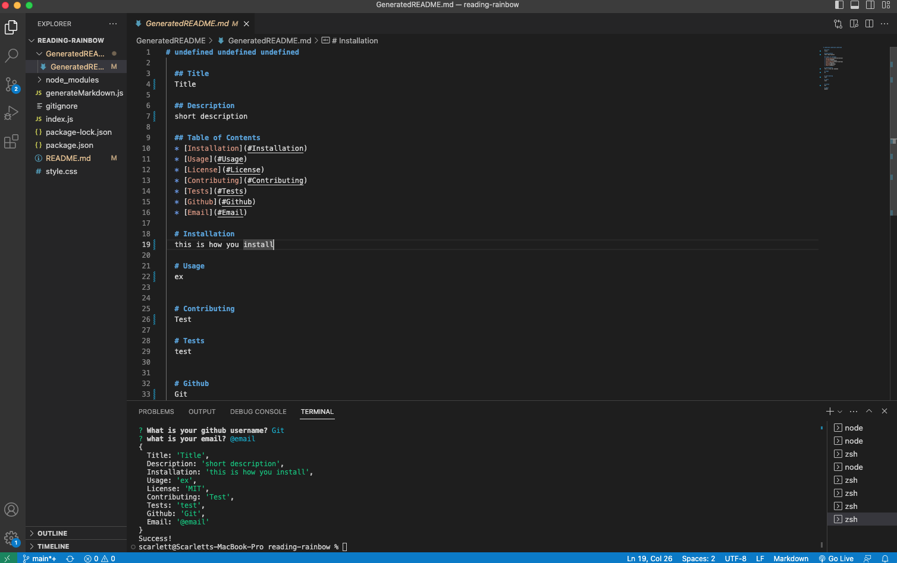

# Reading-Rainbow

## Description 

The motivation behind this project was to make an easier and quicker way for one to create a README.MD within the command line terminal. Creating a the README within the command line saves time and allows for a quicker process for developers to focus on other work wihtout needing to navigate through several different pages or tabs. I really enjoyed creating this project and had fun seeing the README at my fingetips. It felt like a better shortcut and will be using this method as much as possible.




## Table of Contents

* [Installation](#installation)
* [Usage](#usage)
* [License](#license)


## Installation

In order to install this feature you should do the following:

1. Download Node onto your computer
2. Fork the repo from github
3. Clone the repo from github
3. Run "npm install"
4. Run "npm i inquirer@8.2.4" (to download package.JSON)


## Usage 

Once you have followed the above steps run "node index.js" within the command line termainal. You will see the questions prompted within the terminal, make sure to fill out every question. Once all questions have been answered it will populate a README.md file.

To add a screenshot, create an `assets/images` folder in your repository and upload your screenshot to it. Then, using the relative filepath, add it to your README using the following syntax:

```md

```
## License
N/A

## Tests

N/A


